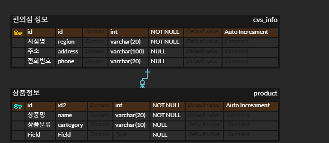

# Django Model Relationship

## 1. User Model BooleanField

- Django에서 기본적으로 사용하는 User 모델은 AbstractUser 모델을 상속받아 정의된다.

  ```python
  class User(AbstractUser):
      """
      Users within the Django authentication system are represented by this
      model.
      Username and password are required. Other fields are optional.
      """
  
      class Meta(AbstractUser.Meta):
          swappable = "AUTH_USER_MODEL"
  ```

- models.py를 참고하여 User 모델에서 사용할 수 있는 컬럼 중 BooleanField로 정의된 컬럼을 모두 작성하시오.

  - is_staff, is_active, is_superuser


## 2. 

### Modeling

- 편의점 상품 관리 프로그램을 제작하기 위해 모델링을 해야 하는 업무가 주어졌다.
  - 모델링은 개발해야 할 소프트웨어의 밑그림으로써 반드시 먼저 고려해야 할 중요한 요소 중 하나이다.

### ERD

- 다음 조건을 참고하여 ERD와 models.py를 자유롭게 작성하고, 작성한 모델링에 대한 소개와 작성하게 된 이유에 대해 간략히 작성하고 발표하시오.
  1. 지점별 편의점들이 존재한다.
  2. 각 상품들은 특정 조건별로 분류할 수 있다.
  3. 단, User는 고려하지 않는다.



``` sql
CREATE TABLE `cvs_info` (
	`id`	int	NOT NULL	COMMENT 'Auto Increament',
	`region`	varchar(20)	NOT NULL,
	`address`	varchar(100)	NULL,
	`phone`	varchar(20)	NULL
);

CREATE TABLE `product` (
	`id2`	int	NOT NULL	COMMENT 'Auto Increament',
	`name`	varchar(20)	NOT NULL,
	`cartegory`	varchar(10)	NULL,
	`Field`	VARCHAR(255)	NULL
);

ALTER TABLE `cvs_info` ADD CONSTRAINT `PK_CVS_INFO` PRIMARY KEY (
	`id`
);

ALTER TABLE `product` ADD CONSTRAINT `PK_PRODUCT` PRIMARY KEY (
	`id2`
);

ALTER TABLE `product` ADD CONSTRAINT `FK_cvs_info_TO_product_1` FOREIGN KEY (
	`id2`
)
REFERENCES `cvs_info` (
	`id`
);
```

