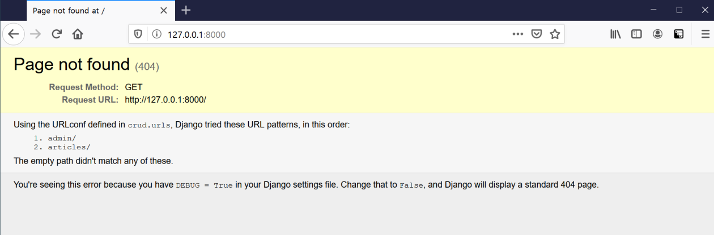

# Django Model Relationship

## 1. MTV

- Django는 MTV로 이루어진 Web Framework다.
- MTV가 무엇의 약자이며 Django에서 각각 어떤 역할을 하고 있는지 작성하시오.
  - M: Model
    - 데이터와 관련된 로직 관리
    - 응용프로그램의 데이터 구조를 정의하고 데이터베이스의 기록을 관리
  - T: Template
    - 레이아웃과 화면 처리
    - 화면상 사용자 인터페이스 구조와 레이아웃을 정의
  - V: View
    - Model & Template과 관련한 로직을 처리해서 응답 반환
    - 클라이언트의 요청에 대해 처리를 분기하는 역할
    - 동작 예시
      - 데이터가 필요하다면 model에 접근해서 데이터를 가져오고 가져온 데이터를 template로 보내 화면을 구성하고, 구성된 화면을 응답으로 만들어 클라이언트에게 반환
  - 정리
    - Model: 데이터 관련
    - Template: 화면 관련
    - View: Model과 Template의 중간 처리 및 응답 반환


## 2. 404 Page not found

- 기본적으로 `/` 페이지에 접속하게 되면 아래 사진처럼 Page not found 에러가 발생한다. `/` 페이지에 접속했을 때 index.html을 렌더링하고자 한다. 아래 빈칸에 알맞은 코드를 작성하시오. (프로젝트의 이름은 crud이며 app 이름은 articles이다. index.html 파일을 렌더링 하는 view 함수의 이름은 index라고 가정한다.)

  

  ```python
  # urls.py
  
  from django.contrib import admin
  from django.urls import path, include
  from __(a)__ import __(b)__
  
  urlpatterns = [
      path('admin/', admin.site.urls),
      path('articles/', include('articles.urls')),
      path('', __(c)__)
  ]
  ```

  - (a): `articles.views`
  - (b): `index`
  - (c): `index, name='index'`


## 3. templates and static

- Django 프로젝트는 기본적으로 render 할 html과 같은 template 파일과 css, js 와 같은 static 파일을 앱 폴더 내부의 templates와 static 이름의 폴더에서 찾는다.
- 만약 해당 위치가 아닌 임의의 위치에 파일을 위치시키고 싶으면 `__(a)__` 파일의 `__(b)__`와 `__(c)__`라는 변수에 담긴 리스트의 요소를 정의하면 된다.
- 빈칸 (a), (b), (c)에 들어갈 내용을 작성하시오.
  - (a): `settings.py`
  - (b): `STATIC_URL`
  - (c): `STATICFILES_DIRS`


## 4. migration

- 아래는 그림과 같이 Django에서 선언한 Model을 Database에 반영하는 과정에서 사용하는 명령어에 대한 설명이다. 각 설명에 해당하는 명령어를 작성하시오(app 이름은 articles이다.).

  ```python
  class Article(models.Model):
      title = models.CharField(max_length=100)
      content = models.TextField()
      created_at = models.DateTimeField(auto_now_add=True)
      updated_at = models.DateTimeField(auto_now=True)
  ```

  1. 마이그레이션 생성: `$ python manage.py makemigrations`

  2. 마이그레이션 DB 반영 여부 확인: `$ python manage.py showmigrations`
  3. 마이그레이션에 대응되는 SQL문 출력: `$ python manage.py sqlmigrate`
  4. 마이그레이션 파일의 내용을 DB에 최종 반영: `$ python manage.py migrate`


## 5. ModelForm True or False

- 각 문항을 읽고 맞으면 T, 틀리면 F를 작성하시오.
  - POST와 GET 방식은 의미론상의 차이이며 실제 동작 방식은 동일하다. `F`
    - GET으로 서버에 동일한 요청을 여러 번 전송하면 항상 같은 응답이 돌아와야 하지만, POST는 서버에 동일한 요청을 여러 번 전송해도 응답이 항상 다를 수 있다.
  - ModelForm과 Form Class의 핵심 차이는 Model의 정보를 알고 있는지의 여부이다. `T`
  - AuthenticationForm은 User 모델과 관련된 정보를 이미 알고 있는 ModelForm으로 구성되어 있다. `F`
    - AuthenticationForm은 일반 Form이다. 모델에게 받는 정보가 없고 새로운 정보를 더 넘겨줘야 하므로, request를 반드시 포함해야 한다.
  - ModelForm을 사용할 때 Meta 클래스에 fields 관련 옵션은 반드시 작성해야 한다. `F`
    - 반드시 작성할 필요 없다.


## 6. media 파일 경로

- 사용자가 업로드한 파일이 저장되는 위치를 Django 프로젝트 폴더(crud) 내부의 /uploaded_files 폴더로 지정하고자 한다.
- 이 때, settings.py에 작성해야 하는 설정 2가지를 작성하시오.
  - `MEDIA_ROOT = BASE_DIR / 'uploaded_files'`
  - `MEDIA_URL = '/uploaded_files/'`


## 7. DB True or False

- 각 문항을 읽고 맞으면 T, 틀리면 F를 작성하시오.
  1. RDBMS를 조작하기 위해서 SQL 문을 사용한다. `T`
  2. SQL에서 명령어는 반드시 대문자로 작성해야 동작한다. `F`
     - SQL문은 대소문자 구분을 하지 않는다.
     - 다만, SELECT나 FROM 등의 예악어는 대문자를 적어주는 것이 일반적이고 그 외 테이블명이나 컬럼명 등은 소문자로 구분되게 적어준다.
  3. 일반적인 SQL문에서는 세미콜론(;)까지를 하나의 명령어로 간주한다. `T`
  4. SQLite에서 .tables, .headers on과 같은 dot(.)로 시작하는 명령어는 SQL 문이 아니다. `T`
     - SQLite 자체가 아닌 sqlite3.exe 명령 줄 프로그램에 의해 해석된다.
  5. 하나의 데이터베이스 안에는 반드시 한 개의 테이블만 존재해야 한다. `F`
     - N: 1, M: N의 관계가 형성될 수 있다.


## 8. on_delete

- 게시글과 댓글의 관계에서 댓글이 존재하는 게시글은 삭제할 수 없도록 즉, ProtectedError를 발생시켜 참조 된 객체의 삭제를 방지하는 `__(a)__`를 작성하시오.

  ```python
  class Article(models.Model):
      title = models.CharField(max_length=100)
      content = models.TextField()
  
  class Comment(models.Model):
      content = models.TextField()
      article = models.ForeignKey(Article, ondelete=modles.__(a)__)
  ```

  - (a): `CASCADE`


## 9. Like in models

- Article 모델과 User 모델을 M: N 관계로 설정하여 '좋아요' 기능을 구현하려고 한다.

- `__(a)__`와 `__(b)__`에 들어갈 내용을 작성하시오.

  ```python
  from django.db import models
  from django.conf import settings
  
  # Create your models here.
  class Article(models.Model):
      content = models.TextField()
      user = models.ForeignKey(settings.AUTH_USER_MODEL, on_delete=models.CASCADE)
      like_users = models.___(a)___(settings.AUTH_USER_MODEL, ___(b)___='like_articles')
  ```

  - (a): `ManyToManyField`
  - (b): `related_name`


## 10. Follow in models

- follow 기능을 구현하기 위해 account app의 models.py에 아래와 같은 모델을 작성하였다. Migration 작업 이후에 Database에 만들어지는 중개 테이블의 이름을 작성하고 이 테이블의 id를 제외한 컬럼 이름을 각각 작성하시오.

  ```python
  from django.db import models
  from django.contrib.auth.models import AbstractUser
  
  # Create your models here.
  class User(AbstractUser):
      followings = models.ManyToManyField('self', symmetrical=False, related_name='followers')
  ```

  - 테이블 이름: `accounts_users_followings`
  - 컬럼 이름
    - `from_user_id`
    - `to_user_id`