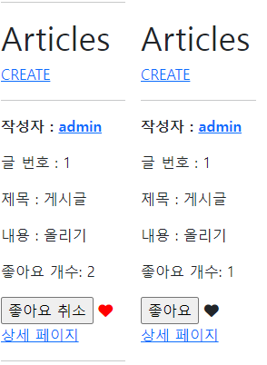

# Django Model Relationship

## DJango Project

- 데이터베이스 M: N 관계를 활용해 좋아요 기능을 구현한 프로젝트에서 이어 진행한다.


## 1. Template

- font-awesome을 사용한다.
  - CDN 코드를 사용해 base.html에 붙여 넣는다.
  - 좋아요에 활용되는 하트 로고를 선택한다. index.html에 좋아요 여부에 따른 결과를 보여준다.
  - 좋아요를 누른 경우 빨간색 하트, 그렇지 않은 경우 검은색 하트가 출력되도록 한다.


## 결과 제출

- 결과 사진과 index.html 코드를 마크다운에 작성해서 제출하시오.

  

  ```html
  <!-- index.html -->
  
  
  
  
    <h1>Articles</h1>
    
      <a href="">CREATE</a>
    
    <hr>
    
      <p>
        <b>작성자 : <a href="">{{ article.user }}</a></b>
      </p>
      <p>글 번호 : {{ article.pk }}</p>
      <p>제목 : {{ article.title }}</p>
      <p>내용 : {{ article.content }}</p>
      <p>좋아요 개수: {{ article.like_users.all|length }}</p> 
      <div>
        <form action="" method="POST">
          
          
            <input type="submit" value="좋아요 취소">
            <i class="fa-solid fa-heart" style="color:red"></i>
          
            <input type="submit" value="좋아요">
            <i class="fa-solid fa-heart"></i>
          
        </form>
      </div>
      <a href="">상세 페이지</a>
      <hr>
    
  
  ```

  