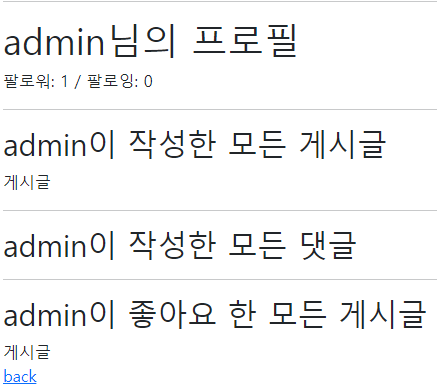
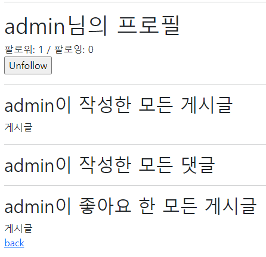
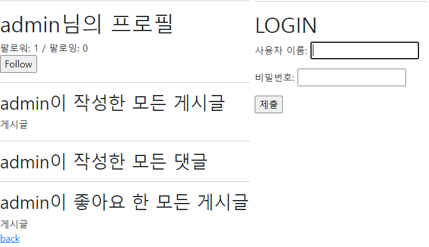
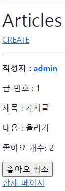

# DJango Model Relationship

## Django Project

- 데이터베이스 M: N 관계를 활용해 팔로우 기능을 구현하시오.


## 1. Model

- 팔로우 기능 구현을 위한 모델관계를 설정한다.
- 기본 내장 User 모델을 대체하여 사용한다.


## 2. url & view

- `/accounts/<username>/`
  - 유저 프로필 페이지 기능을 구현한다.
    - 로그인한 유저만 팔로우를 할 수 있다.


- `/accounts/<int:user_pk>/follow/`
  - 팔로우를 하기 위한 기능을 구현한다.
    - 로그인한 유저만 팔로우를 할 수 있다.
    - 본인은 자기 자신을 팔로우할 수 없다.


## 3. template

- index.html의 username에 profile로 갈 수 있는 링크를 설정한다.
- 팔로잉 여부에 따라 팔로우와 언팔로우 버튼이 토글 될 수 있도록 구성한다.
  - 로그인한 유저 자신의 프로필 페이지에서는 팔로우 & 언팔로우 버튼이 보이지 않는다.
  - 작성자의 팔로잉, 팔로워 숫자를 보여주고 유저의 이름을 모두 출력한다.
- 선택사항
  - 해당 프로필 유저가 작성한 모든 글의 제목과 해당 글의 좋아요 개수를 함께 출력한다.


## 결과 제출

- 팔로우 결과 사진과 accounts/views.py, accounts/models.py, profile.html 코드를 마크다운에 작성해 제출하시오.

  

  

  

  

  ```python
  # accounts/views.py
  
  def profile(request, username):
      User = get_user_model()
      person = User.objects.get(username=username)
      context = {
          'person': person,
      }
      return render(request, 'accounts/profile.html', context)
  
  
  @require_POST
  def follow(request, user_pk):
      if request.user.is_authenticated:
          User = get_user_model()
          me = request.user
          you = User.objects.get(pk=user_pk)
          if me != you:
              if you.followers.filter(pk=me.pk).exists():
                  you.followers.remove(me)
              else:
                  you.followers.add(me)
          return redirect('accounts:profile', you.username)
      return redirect('accounts:login')
  ```

  ```python
  # accounts/models.py
  
  from django.db import models
  from django.contrib.auth.models import AbstractUser
  
  # Create your models here.
  class User(AbstractUser):
      followings = models.ManyToManyField('self', symmetrical=False, related_name='followers')
  ```

  ```html
  <!-- profile.html -->
  
  
  
  
    <h1>{{ person.username }}님의 프로필</h1>
  
    <div>
      팔로워: {{ person.followers.all|length }} / 팔로잉: {{ person.followings.all|length }}
    </div>  
    <div>
      
        <form action="" method="POST">
          
          
              <input type="submit" value="Unfollow">
          
              <input type="submit" value="Follow">
          
        </form>
      
  
    </div>
    <hr>
  
    <h2>{{ person.username }}이 작성한 모든 게시글</h2>
    
      <div>{{ article.title }}</div>
    
    
    <hr>
    
    <h2>{{ person.username }}이 작성한 모든 댓글</h2>
    
      <div>{{ comment.content }}</div>
    
    
    <hr>
    
    <h2>{{ person.username }}이 좋아요 한 모든 게시글</h2>
    
      <div>{{ article.title }}</div>
    
    
    <a href="">back</a>
  
  ```

