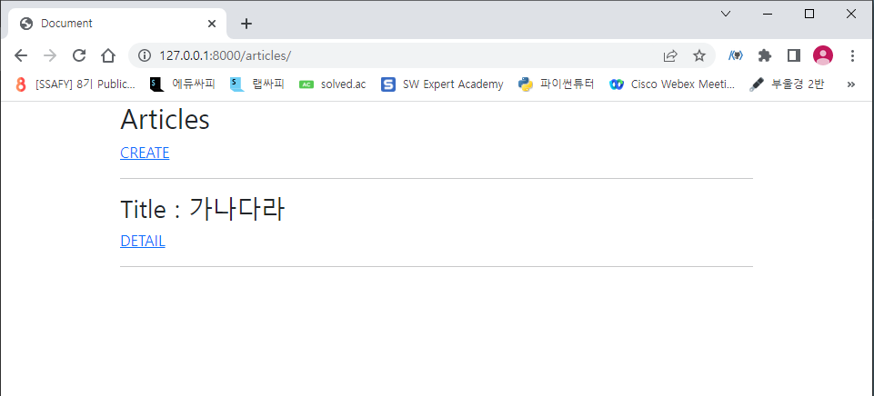
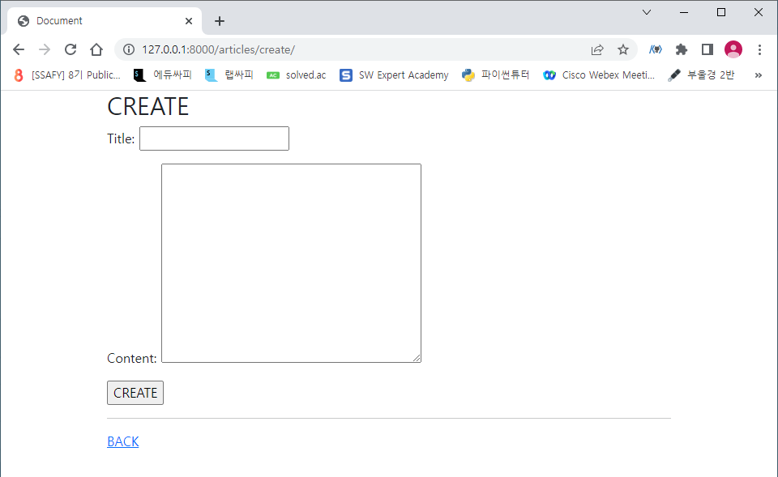

# DJango Workshop

## Form

1. Django Project
     - Django Model Form을 활용해 CRUD을 모두 갖춘 Django 프로젝트를 제작하고 결과 사진과 코드(url, view, template, model)를 별도의 마크다운 파일에 작성하여 제출하시오.

2. 기본 설정

   1. 프로젝트 이름은 crud, 앱 이름은 articles로 설정한다.
   2. 모든 템플릿에서 상속받아 사용할 base.html을 작성한다. base.html이 담긴 templates 디렉토리는 프로젝트 및 앱 디렉토리와 동일한 위치에 생성한다.

3. CRUD 구현

   ```python
   # crud/urls.py
   
   from django.contrib import admin
   from django.urls import path, include
   
   urlpatterns = [
       path('admin/', admin.site.urls),
       path('articles/', include('articles.urls')),
   ]
   ```

   ```python
   # articles/urls.py
   
   from django.urls import path 
   from . import views
   
   
   app_name = 'articles'
   
   urlpatterns = [
       path('', views.index, name='index'),
       path('create/', views.create, name='create'),
       path('<int:pk>/', views.detail, name='detail'),
       path('<int:pk>/update/', views.update, name='update'),
       path('<int:pk>/delete/', views.delete, name='delete'),
   ]
   ```

   ```python
   # articles/views.py
   
   from django.shortcuts import render, redirect
   from .models import Article
   from .forms import ArticleForm
   
   # Create your views here.
   def index(request):
       articles = Article.objects.all()
       context = {
           'articles': articles,
       }
       return render(request, 'articles/index.html', context)
   
   
   def create(request):
       if request.method == 'POST':
           form = ArticleForm(request.POST)
           if form.is_valid():
               article = form.save()
               return redirect('articles:detail', article.pk)
       else:
           form = ArticleForm()
       context = {
           'form': form,
       }
       return render(request, 'articles/create.html', context)
   
   
   def detail(request, pk):
       article = Article.objects.get(pk=pk)
       context = {
           'article': article,
       }
       return render(request, 'articles/detail.html', context)
   
   
   def update(request, pk):
       article = Article.objects.get(pk=pk)
       if request.method == 'POST':
           form = ArticleForm(request.POST, instance=article)
           if form.is_valid():
               article = form.save()
               return redirect('articles:detail', article.pk)
       else:
           form = ArticleForm(instance=article)
       context = {
           'article': article,
           'form': form,
       }
       return render(request, 'articles/update.html', context)
   
   
   def delete(request, pk):
       article = Article.objects.get(pk=pk)
       article.delete()
       return redirect('articles:index')
   ```

   ```html
   <!-- templates/base.html -->
   
   <!DOCTYPE html>
   <html lang="ko-kr">
   <head>
       <meta charset="UTF-8">
       <meta http-equiv="X-UA-Compatible" content="IE=edge">
       <meta name="viewport" content="width=device-width, initial-scale=1.0">
       <link href="https://cdn.jsdelivr.net/npm/bootstrap@5.1.3/dist/css/bootstrap.min.css" rel="stylesheet" integrity="sha384-1BmE4kWBq78iYhFldvKuhfTAU6auU8tT94WrHftjDbrCEXSU1oBoqyl2QvZ6jIW3" crossorigin="anonymous">
       <title>Document</title>
   </head>
   <body>
       <div class="container">
       
       
       
       </div>
       <script src="https://cdn.jsdelivr.net/npm/bootstrap@5.1.3/dist/js/bootstrap.bundle.min.js" integrity="sha384-ka7Sk0Gln4gmtz2MlQnikT1wXgYsOg+OMhuP+IlRH9sENBO0LRn5q+8nbTov4+1p" crossorigin="anonymous"></script>
   </body>
   </html>
   ```

   ```html
   <!-- articles/index.html -->
   
   
   
   
   	<h2>Articles</h2>
     <a href="">CREATE</a>
     <hr>
     
       <h3>Title : {{ article.title }}</h3>
       <a href="">DETAIL</a>
       <hr>
     
   
   ```

   

   ```html
   <!-- articles/create.html -->
   
   
   
   
   	<h2>CREATE</h2>
     <form action="" method="POST">
       <!-- action="" -->
       
       {{ form.as_p }}
       <input type="submit" value="CREATE">
     </form>
     <hr>
     <a href="">BACK</a>
   
   ```

   

   ```html
   <!-- articles/detail.html -->
   
   
   
   
   	<h2>Detail</h2>
   	<hr>
   	<h3>글 번호: {{ article.pk }}</h3>
   	<h3>글 제목: {{ article.title }}</h3>
   	<p>글 내용: {{ article.content }}</p>
   	<p>글 생성시각: {{ article.created_at }}</p>
   	<p>글 수정시각: {{ article.updated_at }}</p>
   	<hr>
   	<a href="">UPDATE</a>
   	<form action="" method="POST">
   		
   		<input type="submit" value="delete">
   	</form>
   	<hr>
   	<a href="">BACK</a>
   
   ```

   

   ```html
   <!-- articles/update.html -->
   
   
   
   
     <h2>UPDATE</h2>
     <form action="" method="POST">
       
       {{ form.as_p }}
       <input type="submit" value="UPDATE">
     </form>
     <hr>
     <a href="">BACK</a>
   
   ```

   

   ```python
   # articles/model.py
   
   from django.db import models
   
   
   # Create your models here.
   class Article(models.Model):
       title = models.CharField(max_length=20)
       content = models.TextField()
       created_at = models.DateTimeField(auto_now_add=True)
       updated_at = models.DateTimeField(auto_now=True)
   ```

   