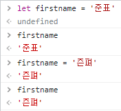
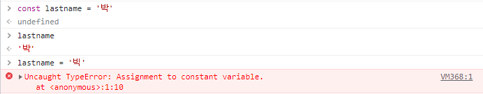
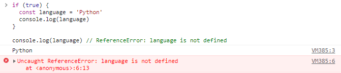
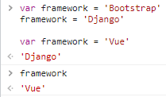
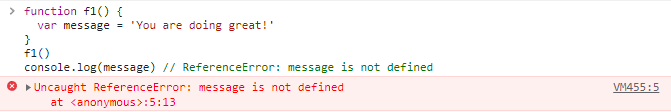
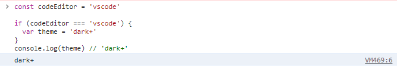
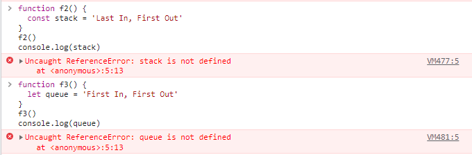
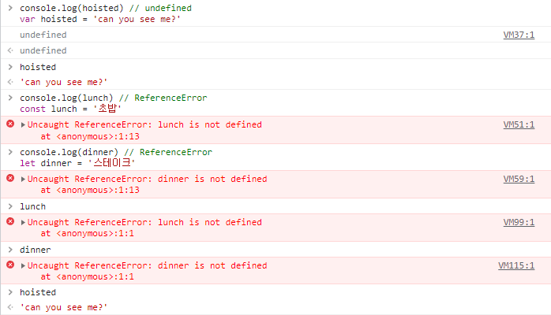

# JavaScript 기초

- let 키워드 연습
  1. let 키워드를 이용하여 firstName 변수를 작성하세요.
  2. firstName 변수에 여러분의 이름을 할당하세요.
  3. firstName 변수의 값을 다른 이름으로 재할당하세요.



- const 키워드 연습
      1. const 키워드를 이용하여 lastName 변수를 작성하세요.
      2. lastName 변수에 여러분의 이름을 할당하세요.
      3. lastName 변수의 값을 다른 이름으로 재할당하세요.
      4. 재할당 에러를 확인하세요.



- 블록 스코프: let 예시

  - 아래 코드 실행 후 결과를 확인해보세요.

  ```js
  let fullName = 'Brendan Eich'
  
  if (true) {
  	let fullName = 'Guido Van Rossum'
  	console.log('블록 스코프:', fullName) // Guido Van Rossum
  }
  
  console.log('전역 스코프:', fullName) // Brendan Eich
  ```

- 블록 스코프: const 예시

  - 아래 코드 실행 후 결과를 확인해보세요.

  ```js
  if (true) {
    const language = 'Python'
    console.log(language)
  }
  
  console.log(language) // ReferenceError: language is not defined
  ```

  

- var 키워드 연습

  1. var 키워드를 이용하여 framework 변수를 작성하세요.
  2. framework 변수에 'Bootstrap'를 할당하세요.
  3. framework 변수에 'Django'를 재할당하세요.
  4. framework 변수를 재선언하고 'Vue'를 할당하세요.

  

- 함수 스코프: var 키워드 예시

  - 아래 코드 실행 후 결과를 확인해보세요.

  ```js
  function f1() {
    var message = 'You are doing great!'
  }
  f1()
  console.log(message) // ReferenceError: message is not defined
  ```

  

- 블록 스코프: var 키워드 예시

  - Tip
    - if 문은 블록 스코프를 생성합니다.
  - 아래 코드 실행 후 결과를 확인해보세요.

  ```JS
  const codeEditor = 'vscode'
  
  if (codeEditor === 'vscode') {
    var theme = 'dark+'
  }
  console.log(theme) // 'dark+'
  ```

  

- 블록 스코프: const, let 키워드 예시

  - Tip
    - const와 let은 블록 스코프입니다.
    - 함수의 중괄호도 블록에 해당됩니다.
  - 아래 코드 실행 후 결과를 확인해보세요.

  ```js
  function f2() {
    const stack = 'Last In, First Out'
  }
  f2()
  console.log(stack) // ReferenceError: stack is not defined
  
  function f3() {
    let queue = 'First In, First Out'
  }
  f3()
  console.log(queue) // ReferenceError: queue is not defined
  ```

  

- 호이스팅(hoisting)

  - 아래 코드 실행 후 결과를 확인해보세요.
  - 그리고 const와 let의 경우와 비교해보세요.
  - 두 줄을 동시에 console에 입력해야 합니다.

  ```js
  console.log(hoisted) // undefined
  var hoisted = 'can you see me?'
  
  console.log(lunch) // ReferenceError
  const lunch = '초밥'
  
  console.log(dinner) // ReferenceError
  let dinner = '스테이크'
  ```

  