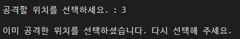

# 02_battleship

## 목표

* Python 함수 사용 숙달
* 프로그래밍 언어를 이용한 간단한 프로그램 제작

# 준비사항

- 개발도구
  - Visual Studio Code
  - Python 3.9+
- 필수 라이브러리
  - random

## 안내사항

주어진 코드를 활용하여 Battleship 게임을 제작합니다.

**[게임 룰 설명]**

1. Battleship 게임은 플레이어와 컴퓨터가 서로 상대방의 배가 있는 위치를 예상하여 맞추는 게임입니다.

2. 플레이어와 컴퓨터는 각각 자신의 해역에 배를 위치시킵니다.
   * 해역은 길이가 15인 1차원 리스트입니다.
   * 배는 플레이어와 컴퓨터 각각 1대씩 존재합니다.
   * 배는 해역 안에서 3칸을 연속하여 차지합니다.
   * 플레이어는 자신의 배를 둘 위치를 직접 입력합니다. 컴퓨터는 배의 위치를 랜덤하게 지정합니다.
   * 플레이어와 컴퓨터는 상대방이 어디에 배를 위치시켰는지 알 수 없습니다.

3. 각 라운드는 플레이어의 선공, 컴퓨터의 후공으로 진행됩니다.
   * 플레이어는 컴퓨터의 해역 중 한 칸의 번호를 직접 입력하여 공격합니다.
   * 컴퓨터는 플레이어의 해역 중 한 칸의 번호를 랜덤하게 지정하여 공격합니다.
   * 공격한 칸에 상대방의 배가 위치한다면, 배는 파괴되고 공격자의 승리로 게임을 종료합니다.
   * 공격한 칸에 상대방의 배가 위치하지 않는다면, 상대방에게 공격 기회가 넘어갑니다.

4. 플레이어와 컴퓨터는 각각 상대방 해역의 어느 칸을 공격했는지 기록합니다.
   * 공격 위치 기록은 이미 공격한 칸을 중복으로 공격하지 않기 위해 사용합니다.
   * 공격 위치 기록은 길이가 15인 1차원 리스트입니다. (해역의 길이와 동일)
   * 이미 공격한 칸은 True, 아직 공격하지 않은 칸은 False로 기록합니다. 

5. 승자가 나올 때까지 계속 라운드를 진행합니다.

**[주의 사항]**

* 주어진 코드는 수정하지 않습니다.

**[변수 설명]**

* player_sea : 플레이어의 해역 리스트
* payer_attacked : 플레이어의 공격 위치 기록 리스트
* computer_sea : 컴퓨터의 해역 리스트
* computer_attacked : 컴퓨터의 공격 위치 기록 리스트
* round : 게임 라운드 수
* player_index : 플레이어가 배를 위치시킬 시작점
* computer_index : 컴퓨터의 랜덤 시작점
* player_attack_index : 플레이어가 고른 공격 위치
* computer_attack_range : 컴퓨터가 공격 가능한 위치 리스트
* computer_attack_index : 컴퓨터가 고른 공격 위치

**[함수 설명]**

* set_ship : 각자의 해역에 배를 위치시키는 함수
  * 파라미터 1 : 배의 시작점의 인덱스
  * 파라미터 2 : 각자의 해역 리스트
  * 시작점의 인덱스를 포함한 그다음 오른쪽 두 칸에 배가 있음을 1로 표시합니다.

* 필요에 따라 추가적으로 함수를 만들어 자유롭게 활용할 수 있습니다.

## 요구사항

1. **게임 준비**

   1-1) 플레이어의 배를 위치시킬 시작점을 고릅니다. 시작점의 위치는 1부터 가능하며, 플레이어는 정수만을 입력한다고 가정합니다.
   
   
   
   
   
   1-2) 만약 해역 범위를 벗어난 시작점을 고르면 다음과 같이 출력하고, 사용자 입력을 다시 받습니다. 
   
   

	
	
	1-3) 컴퓨터는 랜덤으로 시작점이 지정될 수 있도록 `random`모듈을 활용하여 컴퓨터의 해역에 배를 위치시킵니다.
	
	

​		1-4) set_ship 함수를 활용하여 플레이어와 컴퓨터의 해역에 각각 배를 위치시킵니다.

2. **라운드 진행**

   2-1) 플레이어가 선공권을 가집니다. 공격을 진행하기 이전에 다음과 같은 `Information Board`를 출력합니다.

   

   

   2-2) 플레이어의 공격 위치를 선택합니다. 만약 해역의 범위에서 벗어난 위치이거나, 이미 공격한 위치를 선택했다면 다시 플레이어의 입력을 받습니다.

	

	
	
	
	
	2-3) 플레이어는 선택된 위치를 공격하며, 플레이어의 공격이 성공한 경우 다음과 같은 문구를 출력하며 게임을 종료합니다.
	
	
	
	
	
	2-4) 플레이어의 공격이 실패한 경우 플레이어의 공격 위치를 기록하고 컴퓨터의 공격 차례로 넘어갑니다.
	
	
	
	2-5) 컴퓨터가 공격하지 않은 위치를 나타내는 리스트를 만들고, 그 중에서 랜덤하게 컴퓨터의 공격 위치를 고릅니다.
	
	
	
	2-6) 컴퓨터는 지정된 위치를 공격하며, 컴퓨터의 공격이 성공한 경우 다음과 같은 문구를 출력하며 게임을 종료합니다.
	
	
	
	
	
	2-7) 컴퓨터의 공격이 실패한 경우 컴퓨터의 공격 위치를 기록하고, 다음과 같은 문구를 출력하며 다음 라운드로 넘어갑니다.
	
	
