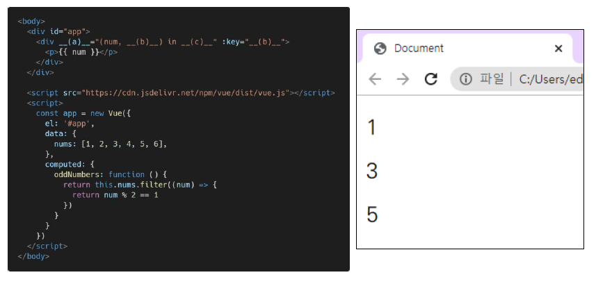

# Vue 기초

1. 아래의 설명을 읽고 T/F 여부를 작성하시오.

   - 동일한 요소에 v-for와 v-if 두 디렉티브가 함께 작성된 경우, 매 반복 시에 v-if의 조건문으로 요소의 렌더링 여부를 결정한다.
     - `T`
   - v-for는 key 속성과 함께 작성하는 것을 권장한다.
     - `T`
   - v-bind는 HTML class 속성에서는 오직 하나의 data와 연결할 수 있다.
     - `F`: 다중 바인딩 

2. method와 computed의 개념과 그 차이에 대해서 간단히 서술하시오.

   - methods
     - Vue instance의 method들을 정의하는 곳
     - method를 호출하여 data 변경 가능
   - computed
     - Vue instance가 가진 option 중 하나
   - methods VS computed
     - methods는 호출 될 때마다 함수를 실행하고, 같은 결과여도 매번 새로 계산한다.
     - 반면, computed는 함수의 종속 대상의 변화에 따라 계산 여부가 결정된다. 즉, 종속 대상이 변하지 않으면 항상 저장된 값을 반환한다.

3. 다음은 홀수 데이터만 렌더링하는 Vue Application의 예시이다. 빈칸 (a), (b), (c)에 들어갈 코드를 작성하시오.

   

   - (a): `v-for`
   - (b): `index`
   - (c): `oddNumbers`