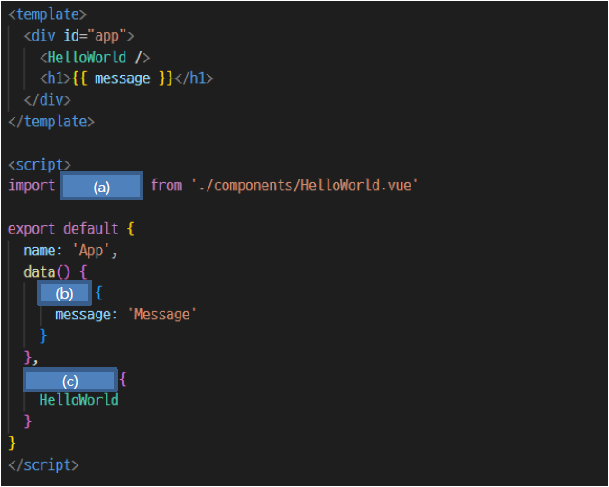
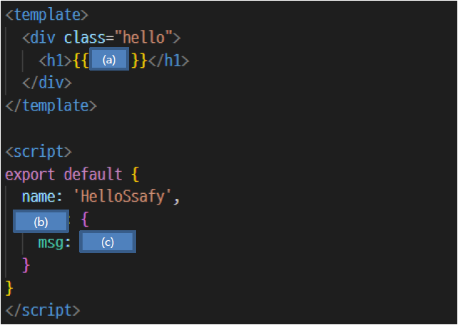

# Vue

1. 아래의 설명을 읽고 T/F 여부를 작성하시오.

   - JS는 브라우저를 조작할 수 있는 유일한 언어이며 브라우저 밖에서 구동할 수 없다.
     - `F`: React, Vue, Angular 등도 가능하다.
   - Data의 흐름을 파악하기 쉽게 하기 위해 Props & emits 를 활용하여 부모-자식 간 Data를 전달한다.
     - `T`
   - emit 은 부모 컨텐츠로의 data를 전달할 수 있으며 조상 컴포넌트로 데이터를 바로 보낼 수는 없다.
     - `T`

2. 다음 Vue component에서 (a), (b), (c)에 알맞은 코드를 작성하시오.

   

   - (a): `HelloWorld`
   - (b): `return`
   - (c): `components`

3. 다음의 자식 컴포넌트는 부모에서 문자열 데이터가 전달되고 있다. 이 때 부모의 문자열 데이터만 전달 받고 이를 출력하기 위해 빈 칸 (a), (b), (c)를 작성하시오.

   

   - (a): `msg`
   - (b): `props`
   - (c): `String`