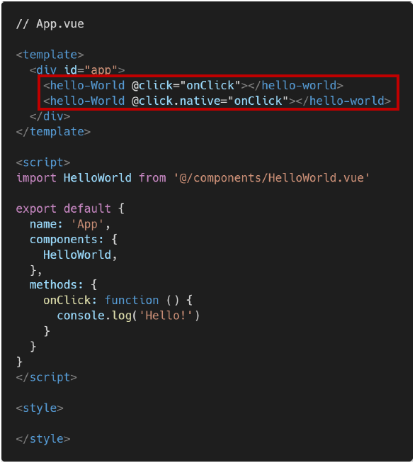
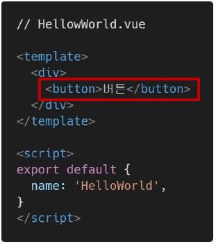
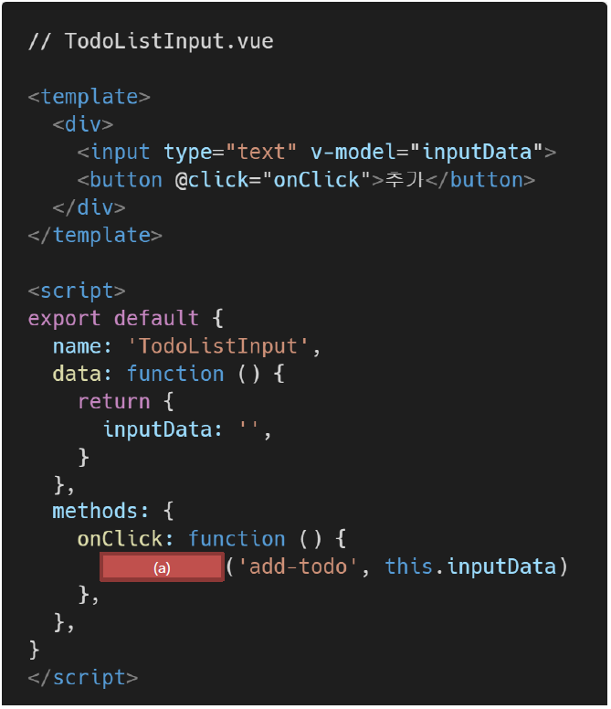
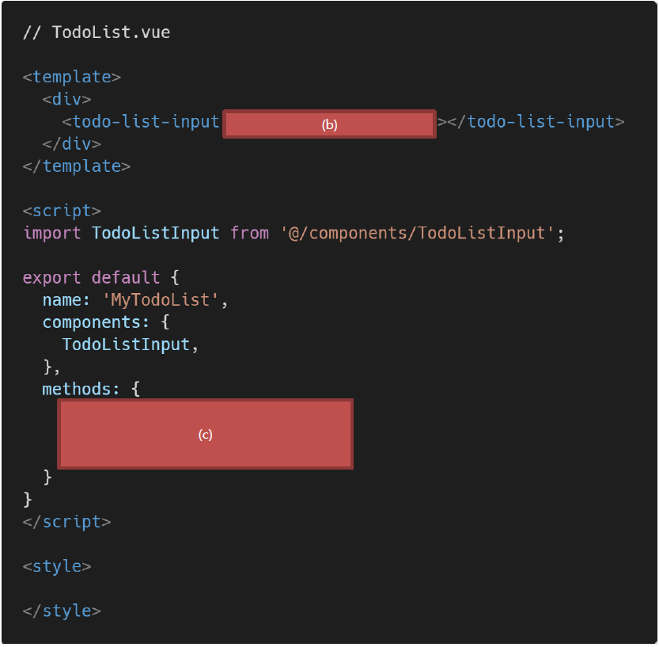

# Vue

1. 아래의 설명을 읽고 T/F 여부를 작성하시오.

   - Vue는 컴포넌트 간 양방향 데이터 흐름을 지향하기 때문에 부모, 자식 컴포넌트 간의 데이터 전달 및 수정이 자유롭다.
     - `F`: Vue는 단방향 데이터 흐름을 지향하는 프론트엔드 프레임워크다.
   - v-on 디렉티브는 해당 요소 또는 컴포넌트에서 특정 이벤트 발생 시 전달받은 함수를 실행한다.
     - `T`
   - 부모 컴포넌트는 props를 통해 자식 컴포넌트에게 이벤트를 보내고, 자식 컴포넌트는 emit을 통해 부모 컴포넌트에게 데이터를 전달한다.
     - `F`: props를 통해 전달되는 것은 데이터, emit을 통해 전달되는 것은 이벤트다.

2. Vue는 단방향 데이터 흐름을 지향하는 프론트엔드 프레임워크다. 그 이유를 서술하시오.

   - 하위 컴포넌트가 실수로 부모의 상태를 변경하여 앱의 데이터 흐름을 추론하기 어렵게 만드는 것을 방지할 수 있다.

3. 아래와 같은 Vue 프로젝트에서 2개의 버튼이 동작하는 것을 비교하여 `.native`수식어의 역할을 작성하시오.

   

   

   - 네이티브는 v-on 이벤트 장식자로서, 컴포넌트의 루트 요소 위에 있는 네이티브 이벤트를 호출한다. 우리가 하위 컴포넌트의 이벤트를 상위 컴포넌트에 전달하기 위해서는 `$emit`을 이용하지만 상위 컴포넌트의 이벤트를 호출하고 싶은 경우에는 하위 컴포넌트에 해당 이벤트를 작성해도 이벤트가 작동하지 않는다. vue 구성요소가 기본 요소에 바인딩하려고 하기 때문이다. 이때 .native를 붙인다면 기본 요소를 무시하고 상위 컴포넌트에 있는 이벤트를 실행시킨다.

4. 다음은 자식 컴포넌트에서 이벤트를 발생시켜 부모 컴포넌트의 함수를 실행하는 코드이다. 빈칸 (a), (b), (c)에 들어갈 코드를 작성하시오.

   - TodoListInput 컴포넌트의 버튼을 누르면 add-todo 이벤트가 발생한다(이벤트 발생 시 data의 text 값도 함께 전달한다.)
   - TodoList 컴포넌트에서 add-todo 이벤트를 청취하면 onAddTodo 메소드를 실행한다.
   - onAddTodo 메소드에서는 TodoListInput 컴포넌트에서 전달받은 값을 console.log 함수를 통해 출력한다.

   

   

   - (a): `this.$emit`

   - (b): `@on-add-todo="onAddTodo"`

   - (c)

     ```vue
     onAddTodo: function (text) {
     	console.log(text)
     }
     ```

     

