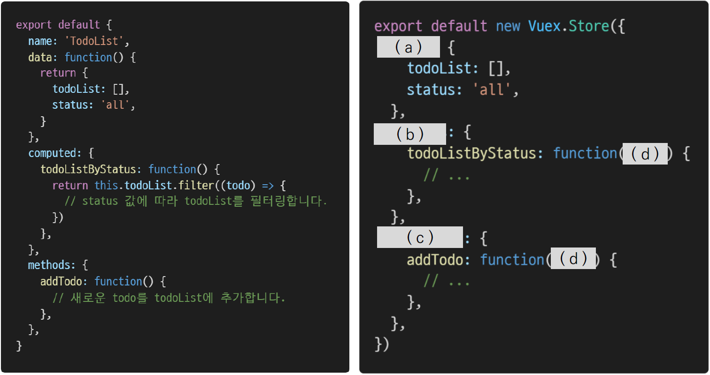
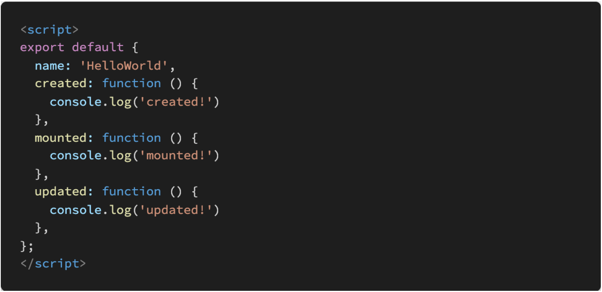

# Vuex

1. 아래의 설명을 읽고 T/F 여부를 작성하시오.

   - Vue 프로젝트에서 상태 관리를 하기 위해서는 반드시 Vuex를 설치해야 한다.
     - `F`: pass props, emit event를 사용하여 상태 관리를 할 수 있으므로, 개발 환경에 따라 적절하게 사용하는 것이 필요하다.
   - mutations는 반드시 state를 수정하기 위해서만 사용되어야 한다.
     - `T`
   - mutations는 store.dispatch로, actions는 store.commit으로 호출할 수 있다.
     - `F`: actions 호출은 store.dispatch, mutations 호출은 store.commit()으로 할 수 있다.
   - state는 data의 역할, getters는 computed와 유사한 역할을 담당한다.
     - `T`

2. Vuex에서 State, Getters, Mutations, Actions의 역할을 각각 서술하시오.

   - State
     - vue 인스턴스의 data에 해당한다.
     - 중앙에서 관리하는 모든 상태 정보
     - 개별 component는 state에서 데이터를 가져와서 사용한다.
   - Mutations
     - 실제로 state를 변경하는 유일한 방법
   - Actions
     - mutations와 비슷하지만 비동기 작업을 포함할 수 있다(외부 API와의 소통 등).
     - state를 변경할 수는 있지만 state를 변경하는 것은 Mutations가 담당하고, commit() 메소드로 mutations를 호출해서 state 변경
   - Getters
     - vue 인스턴스의 computed에 해당
     - state를 활용하여 계산된 값을 얻고자 할 때 사용한다.
     - state의 원본 데이터를 건들지 않고 계산된 값을 얻을 수 있다.

3. 컴포넌트에 작성된 Todo App 관련 코드를 Vuex의 Store로 옮기고자 한다. 빈 칸 (a), (b), (c), (d)에 들어갈 코드를 작성하시오.

   

   - (a): `state`
   - (b): `getters`
   - (c): `mutations`
   - (d): `state`

4. Vue Life Cycle Hook을 참고하여, 다음 Vue application을 실행했을 때, console 창에 출력되는 메시지를 작성하시오.

   

   - `created`, `mounted`가 한 줄씩 순서대로 출력된다.