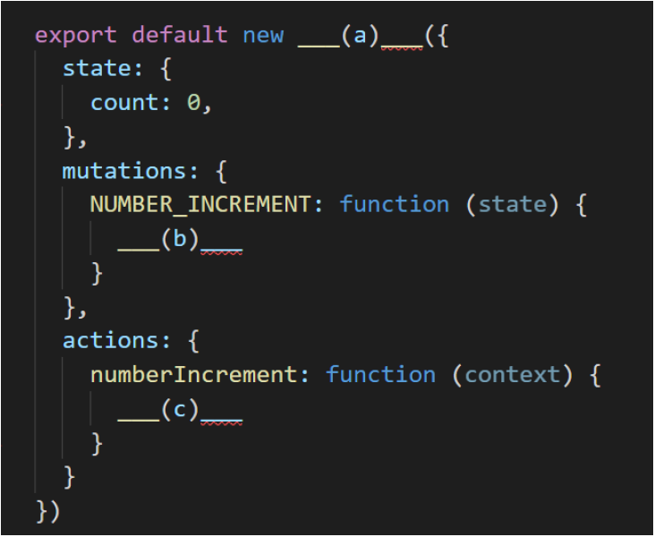
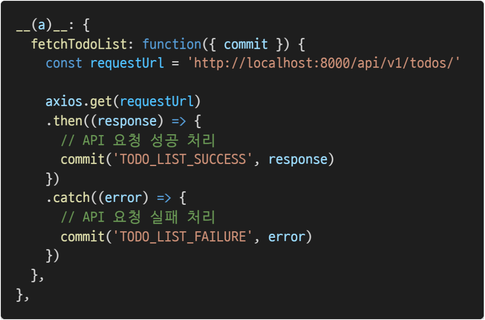

# Vuex

1. 다음은 Vuex로 구성된 하나의 숫자를 counting하는 store이다. (a), (b), (c)에 들어갈 코드를 작성하시오.

   - NUMBER_INCREMENT mutation handler가 호출되면 state의 count를 1만큼 증가시킨다.

   

   - (a): `Vuex.Store`
   - (b): `state.count += 1`
   - (c): `context.commit('NUMBER_INCREMENT')`

2. 아래 예시의 함수는 서버로부터 데이터를 가져 온 뒤, 응답 값을 state에 저장하기 위하여 mutations를 호출하는 로직을 수행한다. 이와 같이 비동기 API 및 mutations 호출에 적합한 store의 속성 (a) 를 작성하시오.

   

   - `actions`

3. store에 정의한 state를 직접 변경하지 않고, mutations를 통해 변경해야 하는 이유를 Vuex 공식문서를 참고하여 작성하시오.

   - 여러 개의 컴포넌트에서 state를 변경하는 경우 어느 컴포넌트에서 해당 state를 변경했는지 추적하기가 어렵기 때문이다.