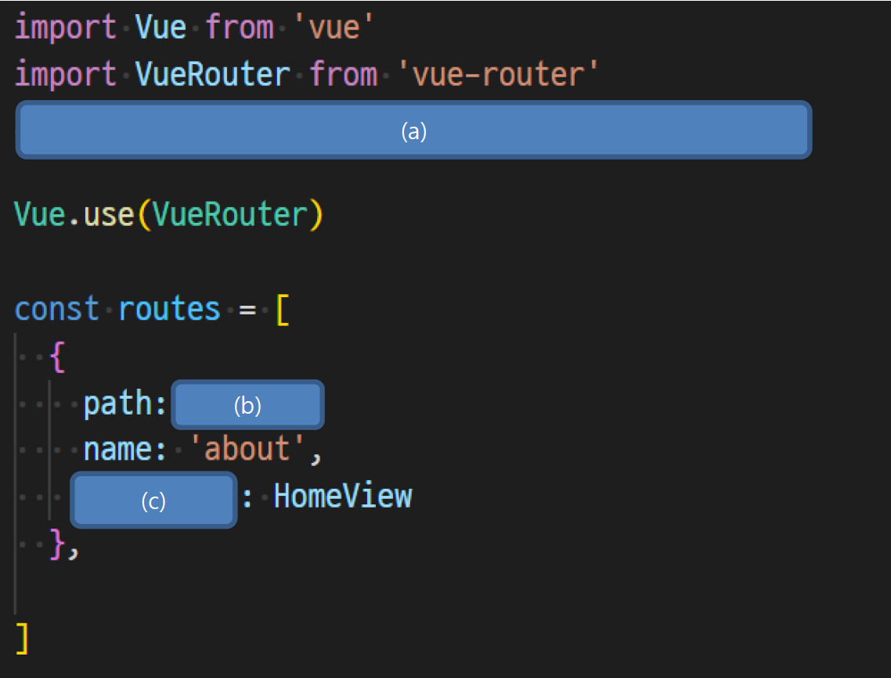

# Vue Router

1. 아래의 설명을 읽고 T/F 여부를 작성하시오.

   - UX와 UI는 동일한 의미로 많이 사용한다.
     - `F`: UX는 사용자 경험을 고려해 디자인하는 것을 의미하고, UI는 사용자가 제품을 어떤 방식으로 이용하도록 만드느냐를 디자인하는 것이다. 같은 의미로 쓰이기보다는 상호 유기적인 의미라고 보는 것이 옳다.
   - UX는 직감으로 결정되는 것이 아니라 하나의 학문으로 연구되는 중요한 분야이다.
     - `T`
   - URL 라우팅은 Server에서만 할 수 있으며 SPA로 개발하는 Front에서는 필요없다.
     - `F`: SPA에서도 서버는 하나의 HTML을 제공하고, 이후의 모든 동작은 JS 코드를 활용하되, DOM을 그리는데 필요한 추가 데이터가 있다면 AJAX 요청을 통해 데이터를 가져오고 처리하는 방식으로 URL Routing을 사용한다.
   - Django의 variable routing처럼 주소로 전달된 값을 사용할 수 있다.
     - `T`

2. Vue Router에서 설정하는 history mode가 무엇을 뜻하는지 서술하시오.

   - 브라우저의 History API를 활용한 방식으로, 새로고침 없이 URL 이동 기록을 남길 수 있다. 히스토리 모드를 사용할 경우, 우리에게 익숙한 `/`를 활용한 URL 구조를 사용 가능하다.
   - 반면, 히스토리 모드를 사용하지 않으면, default 값은 hash mode(`#`을 통해 URL을 구분하는 방식)가 설정된다.

3. 다음 localhost:8080/about 경로를 통하여 views/AboutView.vue 컴포넌트를 보여주기 위한 코드이다. 코드의 빈 칸 (a), (b), (c)를 채우시오.

   

   - (a): `import AboutView from '@/view/AboutView'`
   - (b): `'/about'`
   - (c): `component`

