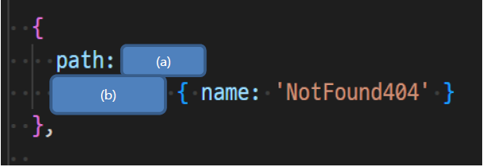

# Vue Router

1. 아래의 설명을 읽고 T/F 여부를 작성하시오.

   - 동적으로 인자를 주소로 전달했을 때 해당 변수에 접근하는 방법은 $router. params를 이용해서 접근할 수 있다.
     - `F`: `$route.params`를 이용해 접근할 수 있다.
   - 전체 route 가 아닌 특정 route 에 대해서만 가드를 설정하고 싶을 때 beforRouteUpdate() 를 사용한다.
     - `F`: `beforeEnter()`사용, `beforeRouteUpdate()`는 특정 컴포넌트 내에서 가드를 지정하고 싶을 때 사용한다.
   - 라우터 가드의 콜백 함수의 인자는 to, from, next 에 대한 값을 인자로 받는다.
     - `T`
   - 사용자가 요청한 리소스가 존재하지 않을 때 404 NOT FOUND 페이지를 표시할 수 있다.
     - `T`

2. lazy loading 를 사용하는 이유를 다음 공식 문서 에서 확인하여 작성하시오.

   - 페이지를 처음 불러올 때 이미지와 같이 사이즈가 큰 데이터를 모두 한꺼번에 불러오면 페이지 로딩이 느려질 수 있다.
   - Lazy loading은 사용자 화면에 디폴트로 보여지는 부분만 우선 로딩하고, 그 하단 등 보이지 않는 곳의 요소들은 로딩이 되지 않고 있다가 사용자가 스크롤을 하면 해당 위치의 이미지들이 로딩되는 형태이다.
   - 모든 파일을 한 번에 로드하지 않아도 되기 때문에 최초에 로드하는 시간이 빨라진다.

3. 다음은 요청하는 경로가 없을 때 Not Found 404 페이지를 보여주기 위한 코드이다. 코드의 빈 칸을 작성하시오.

   

   - (a): `'*'`
   - (b): `redirect:`

   

