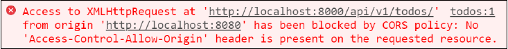
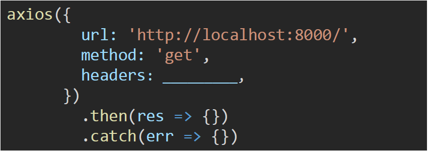

# Vue with server


1. 아래의 설명을 읽고 T/F 여부를 작성하시오.

   - Client-Server 모델에서 Vue 는 Client 파트 , DRF 는 Server 파트를 담당한다.
     - `T`
   - Vue 는 Django 와 동일하게 하나의 웹서버로 운용되며 자체적으로 database 연동, 회원가입 등의 기능이 제공된다.
     - `F`: Vue는 프론트엔드 프레임워크로 DJango처럼 웹서버를 만드는 프레임워크가 아니라 SPA를 만드는 프레임워크이다. / 프론트엔드 프레임워크는 Client Side에서 필요한 데이터를 서버로부터 받아와 활용한다.
   - Vue 의 최종 build 된 모습은 브라우저가 받아보는 한 장의 HTML 문서와 서버 측으로부터 응답 받은 리소스로 이루어져 있다.
     - `T`

2. 아래 예시는 Vue에서 DJango 서버로 네트워크 요청을 보냈을 때 발생한 에러다. 에러가 발생한 원인과 해결 방법을 작성하시오.

   

   - 기본적으로 브라우저는 AJAX 통신을 통해 서로 다른 출처 간 자원을 교환할 때 SOP(동일 출처 정책)를 따르는데, 현재 클라이언트와 서버 간의 출처가 다르기 때문에 에러 발생
   - 이를 해결하기 위해서는 Django 서버에서 CORS 관련 헤더(Access-Control-Allow-Origin)를 설정하여 응답하면 해결된다.

3. DRF 서버에서 토큰 기반 인증을 사용할 때, axios로 요청을 보낼 경우 발급받은 토큰을 포함하여 요청을 보내는 코드를 작성하시오. (토큰값은 1234라고 가정한다.)

   

   ```Vue
   { Authorization: 'Token 1234' }
   
   axios({
   	url: URL,
   	method: 'get'
   	headers: { Authorization: 'Token 1234' },
   })
   	.then(res => {})
   	.catch(err => {})
   ```

   

