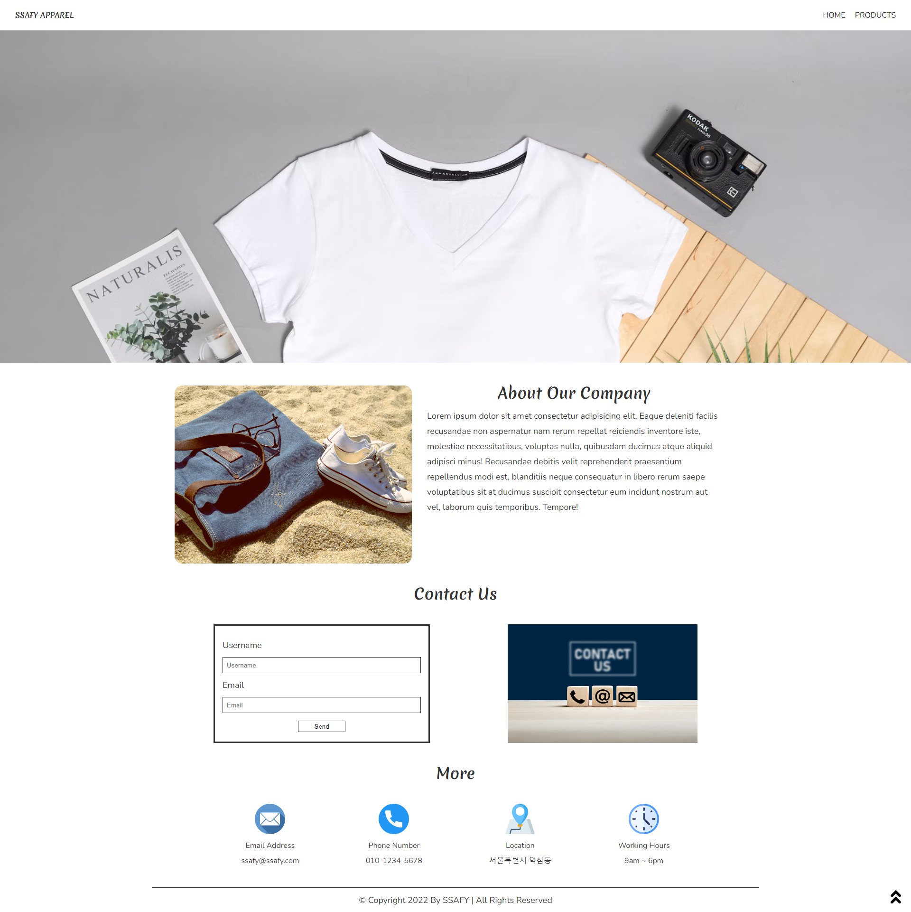
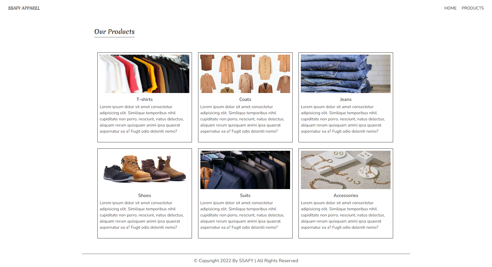

# 04_web_practice

## 목표

* HTML 및 CSS를 활용한 상용 서비스 페이지 제작
* CSS 라이브러리의 이해와 활용

## 준비사항

* 개발도구
  - Visual Studio Code
  - Google Chrome Browser
  - Bootstrap v5
* open in browser extension

## 안내사항

스켈레톤 코드를 활용하여 SSAFY APPAREL 페이지를 제작합니다.

**[제공 Assets]**

| assets/       | 사용할 이미지들이 들어 있습니다.     |
| ------------- | ------------------------------------ |
| index.html    | 메인 페이지입니다.                   |
| products.html | 제품 상세 페이지입니다.              |
| **css/**      | **css 파일들이 들어 있습니다.**      |
| style.css     | 모든 페이지의 스타일링을 담당합니다. |
| reset.css     | 브라우저 기본 스타일을 초기화합니다. |

**[예시 화면]**

* `index.html`

* `products.html`

## 요구사항

**[index.html]**

1. 내비게이션 바(Navigation Bar)
   * 내비게이션 바는 스크롤을 하더라도 항상 상단에 고정되어 있습니다.
   * 내비게이션 바 왼쪽은 `SSAFY APPAREL` 페이지의 제목을 표시하며, 오른쪽은 HOME, PRODUCT 메뉴를 표시합니다.
   * 내비게이션 바의 HOME, PRODUCT 메뉴는 각각 `index.html`, `products.html`로 이동할 수 있는 링크입니다.
2. 본문 영역
   * apparel 이미지를 활용하여 예시 화면과 같이 배너를 설정합니다.
   * apparel2 이미지를 활용하여 About Our Company 영역을 레이아웃 합니다. 왼쪽에는 이미지가, 오른쪽에는 제목과 내용을 적절하게 배치합니다. lorem을 활용하여 내용을 채웁니다.
   * Contact Us 영역 제목 아래 Username 및 Email을 기입하고 전송할 수 있는 버튼을 담은 Form을 제작합니다. Form의 우측 영역에는 contact 이미지가 위치합니다.
   * More 영역 제목 아래 4가지 정보를 표시하되, 각각의 정보는 이미지 및 텍스트 요소가 세로로  배치되게 합니다. 이미지 크기를 적절하게 줄여 레이아웃을 예시 화면처럼 보이게끔 설정합니다.
3. 푸터 영역
   * Copyright 문구를 넣고, 본문 영역과 구분선을 활용하여 분리합니다.
   * 우측 하단의 화살표를 클릭하면 페이지의 맨 위로 이동할 수 있도록 설정합니다.

**[products.html]**

1. 내비게이션 바는 `index.html`과 동일합니다.
2. Our Products 제목은 밑줄이 존재합니다.
3. 본문 영역에는 동일한 너비의 6개의 카드가 위치합니다. 각각의 카드는 T-shirts, Coats, Jeans, Shoes, Suits, Accesories이며, lorem을 활용한 설명과 이미지가 카드 안에서 세로로 배치됩니다.
4. 푸터는 `index.html`과 동일합니다.

**[기타 사항]**

1. 마진과 패딩은 예시 화면과 비슷하게끔 자유롭게 설정할 수 있습니다.
2. 스켈레톤 코드에 포함된 폰트 이외에 원하는 폰트를 사용할 수 있습니다.

3. 부트스트랩과 CSS를 자유롭게 사용합니다.
