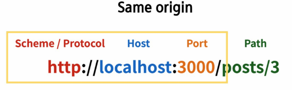

# Vue

## Vue with DRF

### Server & Client

- Server
  - 개요
    - 클라이언트에게 정보와 서비스를 제공하는 컴퓨터 시스템
    - 서비스 전체를 제공 == Django Web Service
    - 정보를 제공 == DRF API Service
  - 서비스 전체를 제공 == Django Web Service
    - Django를 통해 전달받은 HTML에는 하나의 웹 페이지를 구성할 수 있는 모든 데이터가 포함된다.
    - 즉, 서버에서 모든 내용을 렌더링해 하나의 HTML 파일로 제공
    - 정보를 포함한 web 서비스를 구성하는 모든 내용을 서버 측에서 제공
  - 정보를 제공 == DRF API Service
    - Django를 통해 관리하는 정보만을 클라이언트에게 제공
    - DRF를 사용하여 JSON으로 변환
- Client
  - 개요
    - Server가 제공하는 서비스에 적절한 요청을 통해 Server로부터 반환 받은 응답을 사용자에게 표현하는 기능을 가진 프로그램 혹은 시스템
  - 서버가 제공하는 서비스에 적절한 요청
    - 서버가 정의한 방식대로 요청 인자를 넘겨 요청
    - 서버는 정상적인 요청에 적합한 응답 제공
- 정리
  - 서버는 정보와 서비스를 제공
    - DB와 통신하며 데이터 생성, 조회, 수정, 삭제 담당
    - 요청을 보낸 클라이언트에게 정상적인 요청이었다면 처리 결과 응답
  - 클라이언트는 사용자의 정보 요청을 처리, 서버에게 응답 받은 정보를 표현
    - 서버에게 정보(데이터)를 요청
    - 응답 받은 정보를 가공하여 화면에 표현

### Again DRF

## CORS

### Cross-Origin Resource Sharing

- What Happened?

  - 브라우저가 요청을 보내고 서버의 응답이 브라우저에 도착
    - Server의 log는 200(정상) 반환
    - 즉 서버는 정상적으로 응답했지만 브라우저가 막은 것
  - 보안상의 이유로 브라우저는 동일 출처 정책(SOP)에 의해 다른 출처의 리소스와 상호작용하는 것을 제한한다.

- SOP(Same-Origin Policy)

  - 동일 출처 정책
  - 불러온 문서나 스크립트가 다른 출처에서 가져온 리소스와 상호작용하는 것을 제한하는 보안 방식
  - 잠재적으로 해로울 수 있는 문서를 분리함으로써 공격받을 수 있는 경로를 줄인다.

- Origin - 출처

  - URL의 프로토콜, 호스트, 포트를 모두 포함하여 출처라고 부른다.

  - Same Origin 예시

    - 아래 세 영역이 일치하는 경우에만 동일 출처로 인정한다.

    

- CORS - 교차 출처 리소스 공유
  - 추가 HTTP Header를 사용하여, 특정 출처에서 실행 중인 웹 어플리케이션이 다른 출처의 자원에 접근할 수 있는 권한을 부여하도록 브라우저에 알려주는 체제
    - 어떤 출처에서 자신의 컨텐츠를 불러갈 수 있는지 서버에 지정할 수 있는 방법
  - 리소스가 자신의 출처와 다를 때 교차 출처 HTTP 요청을 실행
    - 만약 다른 출처의 리소스를 가져오기 위해서는 이를 제공하는 서버가 브라우저에게 다른 출처지만 접근해도 된다는 사실을 알려야 한다.

### How to set CORS

- CORS 표준에 의해 추가된 HTTP Response Header를 통해 이를 통제 가능
- HTTP Response Header 예시
  - Access-Control-Allow-Origin
- Access-Control-Allow-Origin
  - 단일 출처를 지정하여 브라우저가 해당 출처가 리소스에 접근하도록 허용

## DRF Auth System

## DRF Auth with Vue

## DRF-spectacular

